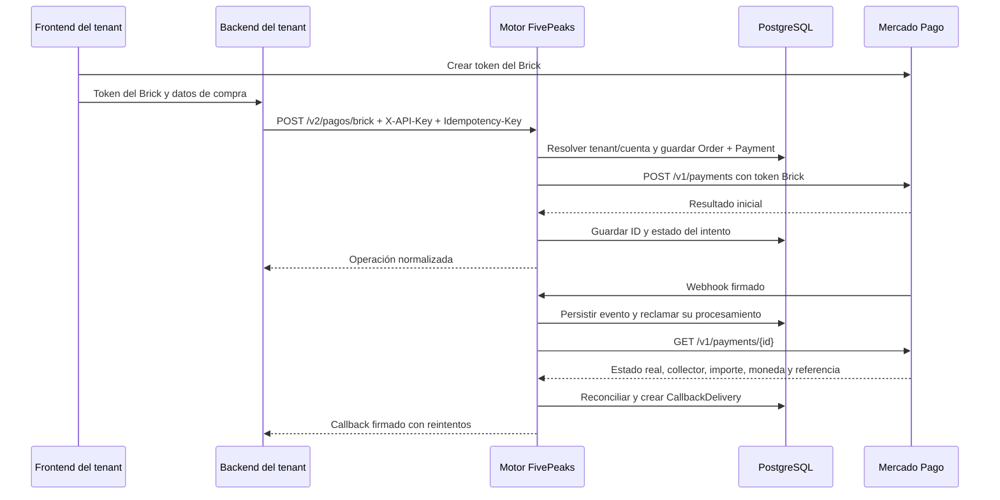

# Visión funcional

## Propósito

El Motor de Pagos FivePeaks es un intermediario entre los sistemas de sus clientes y Mercado Pago. Centraliza la vinculación OAuth, la creación de operaciones de cobro, la conciliación del estado con Mercado Pago y la notificación al sistema que inició el cobro.

El motor es multi-tenant. Cada `Client` es un tenant o sistema integrado, por ejemplo `ENUAR`. Una cuenta conectada de Mercado Pago se representa con `Vendor`. Una orden pertenece a un tenant y a una cuenta cobradora concreta; cada intento ante Mercado Pago se registra como `Payment`.

## Actores y responsabilidad del dinero

| Actor | Responsabilidad |
|---|---|
| Sistema del tenant | Inicia operaciones desde su backend usando su API key. Recibe notificaciones en su `callback_url`. |
| Tenant (`Client`) | Es la identidad y el límite de aislamiento dentro del motor. Guarda la API key hasheada y los datos de callback. |
| Cuenta MP (`Vendor`) | Es la cuenta que recibe el dinero. En V2 el tenant tiene una sola cuenta activa. |
| Comprador | Usa la interfaz de la plataforma y el token generado por Mercado Pago Bricks. |
| Motor FivePeaks | Crea órdenes e intentos, verifica el resultado directamente con Mercado Pago y avisa al tenant. |
| Mercado Pago | Procesa el pago y es la fuente de verdad para el estado del intento. |

Una página visual no necesita un `Client` por el solo hecho de ser otra URL. Se crea un `Client` por sistema/cliente integrado que necesita identidad, API key y configuración de callbacks independientes. Varias páginas del mismo sistema pueden compartir el tenant.

## Quién cobra

En el modelo actual, el dinero de una operación se acredita en la cuenta Mercado Pago vinculada al `Vendor` asignado a la orden. La API key identifica al `Client`, pero el cliente no puede elegir `vendor_id` en V2. El motor resuelve la cuenta activa del tenant.

Casos contemplados:

1. **Cobros de una plataforma cliente:** el tenant conecta su propia cuenta de Mercado Pago y el pago se procesa con esa cuenta.
2. **Ingresos de FivePeaks:** cuando se implemente el cobro de suscripciones a FivePeaks, FivePeaks será el tenant y cobrará en su propia cuenta MP.

El segundo caso es una decisión futura de producto. Esta versión no implementa suscripciones recurrentes, `/preapproval`, planes ni comisiones/split automáticos.

## Flujos

### Vincular una cuenta MP en V2

1. El backend del tenant solicita una URL OAuth con `GET /v2/auth/mp-url` y su `X-API-Key`.
2. El usuario inicia sesión en Mercado Pago y autoriza la aplicación.
3. Mercado Pago redirige al callback V2 configurado.
4. El motor valida un `state` aleatorio, temporal y de un solo uso, intercambia el código por credenciales y cifra los tokens.
5. El motor activa esa cuenta para V2 y desactiva la anterior del mismo tenant.
6. El motor intenta notificar el resultado al `callback_url` del tenant y redirige al `redirect_uri` configurado.

### Cobrar con Payment Brick

1. El frontend del tenant obtiene el token del Brick usando la integración de Mercado Pago.
2. El frontend entrega ese token a su propio backend.
3. El backend del tenant llama al motor con API key, clave de idempotencia, referencia externa e información de pago.
4. El motor obtiene la cuenta MP activa del tenant, verifica su identidad y guarda `Order` y `Payment` antes de llamar a Mercado Pago.
5. El motor solicita el pago a Mercado Pago con una clave de idempotencia propia y devuelve una respuesta normalizada.
6. Mercado Pago notifica al webhook del motor. El motor guarda el evento, consulta el recurso a MP, valida titular, referencia, importe y moneda, y reconcilia el pago.
7. Los cambios confirmados generan una entrega durable al callback del tenant.

El backend del tenant nunca debe exponer la API key del motor en el navegador. El token de tarjeta del Brick sí atraviesa el backend del tenant para llegar al motor y a Mercado Pago; no se persiste en la tabla `Payment`.

## Órdenes e intentos

- `external_id` identifica una operación del sistema del tenant y es único por tenant.
- `Order` conserva la intención de cobro: importe, moneda, concepto, tenant y cuenta cobradora.
- `Payment` representa cada intento de procesar esa orden. Una orden puede tener más de un intento.
- `Idempotency-Key` identifica una solicitud del tenant. Repetir clave y contenido reutiliza la operación; usar la misma clave con contenido distinto produce conflicto.
- El `X-Idempotency-Key` enviado a Mercado Pago es independiente y queda persistido para que los reintentos del motor no creen otro cobro.

## Estados de pago

| Estado de Mercado Pago | Estado guardado |
|---|---|
| `approved` | `APPROVED` |
| `rejected` | `REJECTED` |
| `cancelled` | `CANCELLED` |
| `refunded` | `REFUNDED` |
| `charged_back` | `CHARGED_BACK` |
| `pending`, `in_process` y cualquier estado desconocido | `PENDING` |

El estado de `Payment` representa un intento. `Order.estado` representa el intento actual de la orden. El recurso consultado directamente a Mercado Pago se usa para reconciliar; no se confía en que el body del webhook describa el estado final.

## Dos webhooks distintos

1. **Webhook entrante de Mercado Pago:** llega al motor en `/v2/webhook/mercadopago`. El motor valida su firma, consulta MP y actualiza sus propios datos.
2. **Callback saliente al tenant:** el motor envía el resultado a `Client.callback_url`, firmado con `Client.webhook_secret` y reintentado desde una cola persistida.

El callback de vinculación OAuth también usa esos datos, pero hoy se envía de forma inmediata y no usa la cola durable de pagos.
